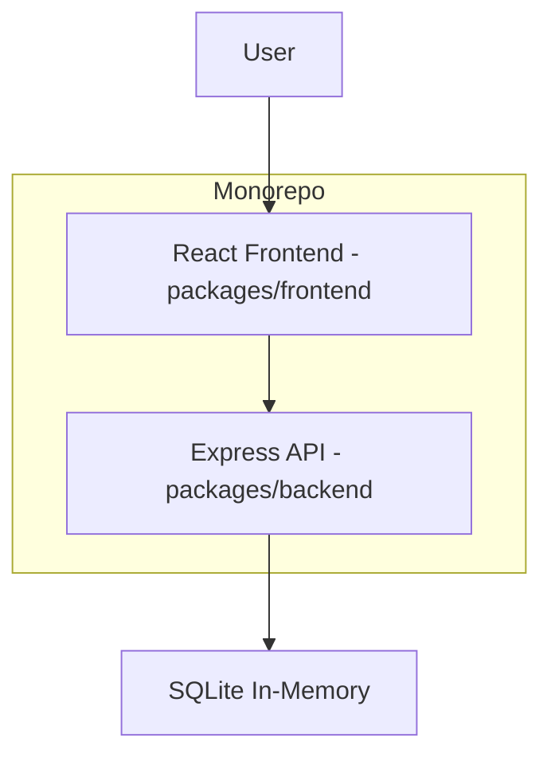

# Cloud Architecture Overview

This diagram illustrates the monorepo structure and runtime flow between the React frontend and Express backend.

```mermaid
flowchart TD
  U[User]
  FE[React Frontend - packages/frontend]
  BE[Express API - packages/backend]
  DB[SQLite In-Memory]

  U --> FE
  FE --> BE
  BE --> DB

  subgraph Monorepo
    FE
    BE
  end
```
